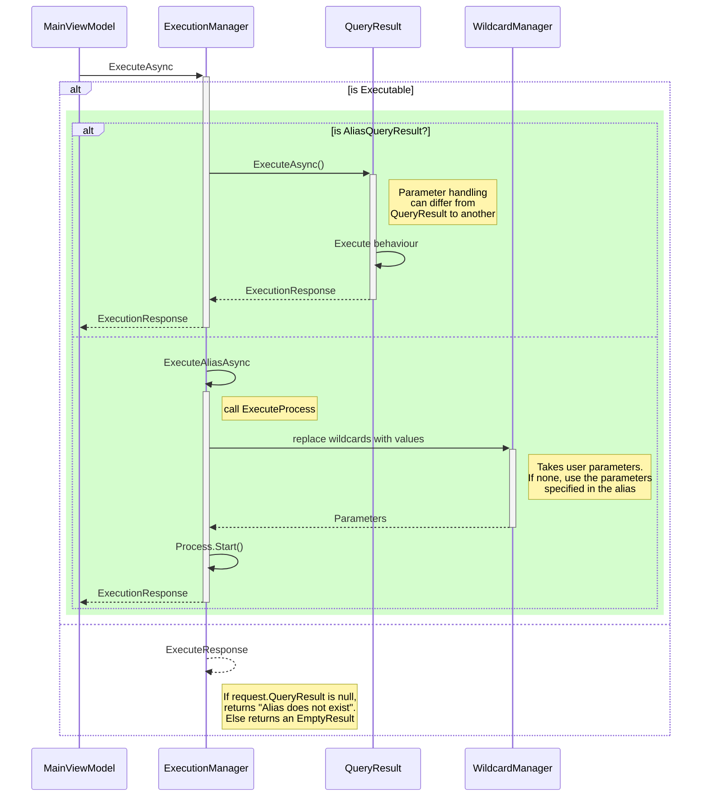
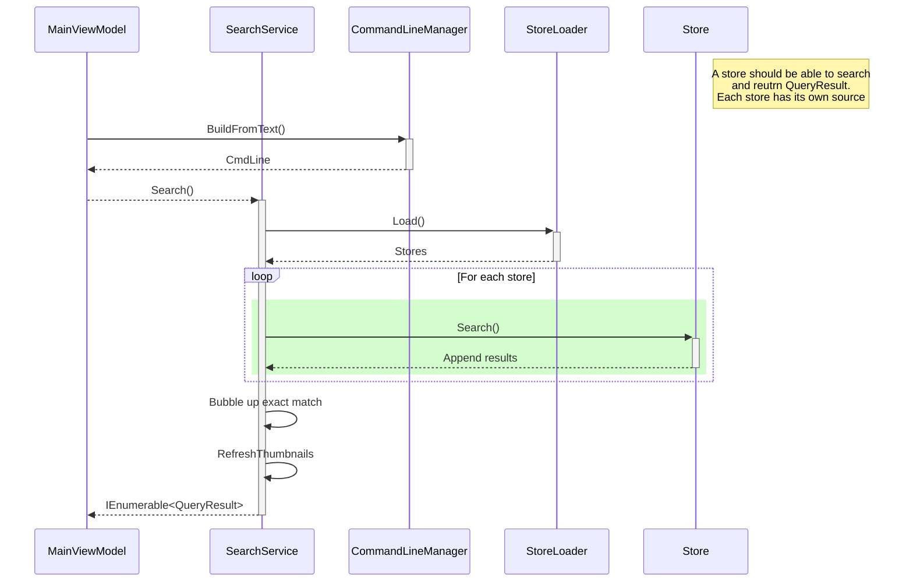

# Excute an alias from a command line

## How is written a command line? 
 > command arg1 arg2 arg3

* If the *command line* starts with `$ & | @ # ( ) § ! { } - _ \\ + - * / = < >  ; : % ` then the command is this character
 * Otherwise everything before the first *space* is the command
 * Everything after the first *space* is the arguments

## Sequence diagram

# Search an alias from a command line

## Index

| Name               | Definition                                                                      |
| ------------------ | ------------------------------------------------------------------------------- |
| **Alias**          | a short name used to launch a specific application with specfic argument        |
| **Plugin**         | special command with a UI (or not)                                              |
| **Repository**     | a list of shortcuts managed by something else than *Lanceur*                    |
| **Macro**          | special keyword used in a shortcut (ie: @MULTI@ that launches multiple aliases) |
| **Internal Alias** | a keyword reserved by *Lanceur*                                                 |

## Sequence diagram

