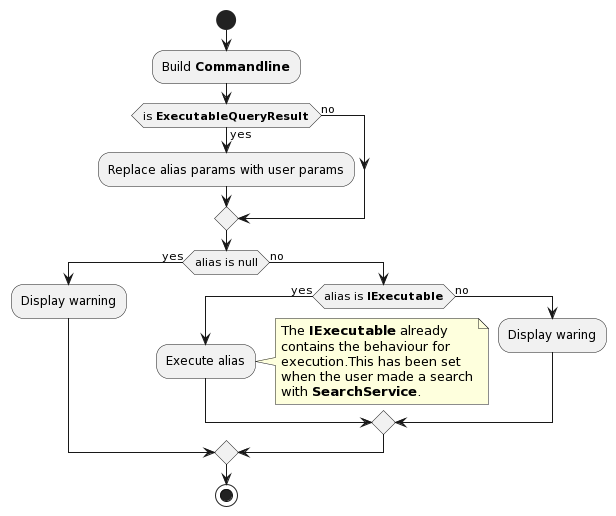

[Back](../README.md)

# Commandline execution

## Index

| Name               | Definition                                                                      |
| ------------------ | ------------------------------------------------------------------------------- |
| **Alias**          | a short name used to launch a specific application with specfic argument        |
| **Plugin**         | special command with a UI (or not)                                              |
| **Repository**     | a list of shortcuts managed by something else than *Lanceur*                    |
| **Macro**          | special keyword used in a shortcut (ie: @MULTI@ that launches multiple aliases) |
| **Internal Alias** | a keyword reserved by *Lanceur*                                                 |

## Activity diagram

