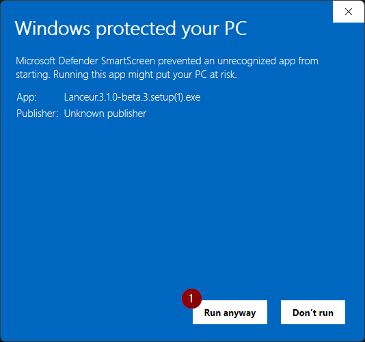
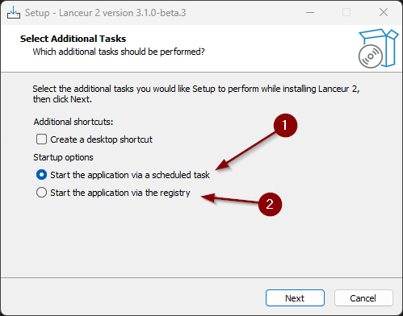

# Installation

## Via Winget (recommandé)

La façon la plus simple d'installer Lanceur est via [winget](https://learn.microsoft.com/fr-fr/windows/package-manager/winget/) :

```powershell
winget install jbwautier.lanceur
```

## Installation manuelle

Visitez la page des versions [ICI](https://github.com/jibedoubleve/lanceur-bis/releases) et téléchargez le fichier `Lanceur.x.x.x.setup.exe`.

## Avertissement SmartScreen

Cet avertissement apparaît parce que le programme d'installation est récent et n'a pas encore été reconnu par Microsoft. Soyez assuré que le logiciel est open source et totalement sûr — vous pouvez consulter le code source ici : [Code source](https://github.com/jibedoubleve/lanceur-bis).

Pour continuer, cliquez sur **"Plus d'informations"** puis sur **"Exécuter quand même."** (1)



## Choisissez comment l'application démarre au démarrage

- 1. **Démarrer l'application via une tâche planifiée** (Fonctionnalité expérimentale) : Le programme d'installation crée une tâche planifiée qui lance Lanceur lorsque l'utilisateur ouvre une session. *Remarque : Cette méthode présente un problème connu où l'application se ferme lorsque l'ordinateur passe sur batterie.*
- 2. **Démarrer l'application via le registre** : Lanceur sera ajouté au registre pour démarrer automatiquement à l'ouverture de session.



> La méthode par tâche planifiée est plus rapide que la méthode par registre car elle s'exécute avec une priorité plus élevée, contourne les délais de démarrage, s'exécute avant le chargement de l'Explorateur et évite les problèmes de permissions potentiels. Cependant, en raison du problème connu avec la batterie, les utilisateurs peuvent préférer la méthode par registre pour plus de stabilité.
