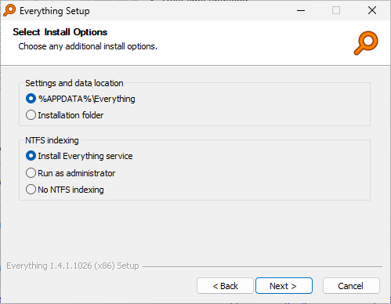

# Prérequis pour l'installation de Lanceur

## Prérequis pour la recherche de fichiers

Pour utiliser la fonctionnalité de recherche de fichiers dans *Lanceur*, vous devez installer *Voidtools Everything*.

Si *Everything* n'est pas installé ou ne fonctionne pas, la fonction de recherche ne retournera aucun résultat.

## Installation de *Voidtools Everything*

Suivez ces étapes pour installer *Everything* :

1. **Téléchargez le programme d'installation** depuis [ICI](https://www.voidtools.com/downloads/).
2. **Exécutez le programme d'installation** et conservez les valeurs par défaut.
3. **Activez le service et configurez-le pour démarrer automatiquement**.

