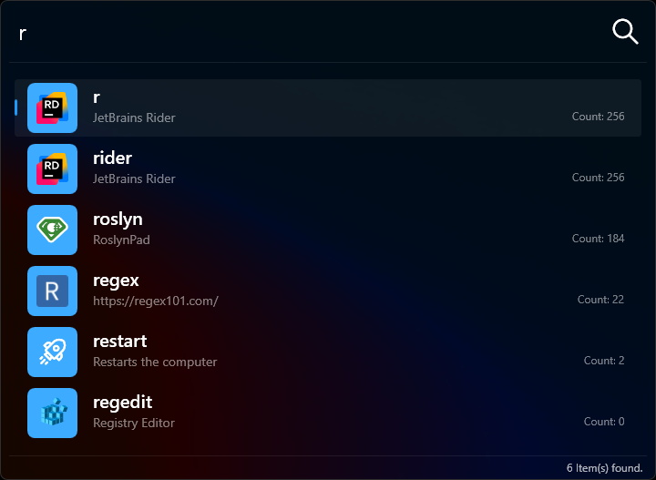

# Lanceur - Lancez tout, instantanément

---

## Qu'est-ce que Lanceur ?

Lanceur est un lanceur d'applications léger et hautement personnalisable, développé en .NET. Inspiré de [SlickRun](https://www.bayden.com/slickrun/), avec des fonctionnalités influencées par [Wox](https://github.com/Wox-launcher/Wox) et [Flow Launcher](https://www.flowlauncher.com/), il vous permet d'ouvrir des applications, des fichiers et des pages web instantanément — tapez simplement un raccourci et appuyez sur `ENTRÉE`.

J'ai commencé Lanceur parce que je voulais créer mon propre projet — quelque chose qui porterait mon nom et fonctionnerait exactement comme je l'imaginais. J'adore SlickRun, mais je voulais ma propre version, avec quelques différences mieux adaptées à mon flux de travail. Si d'autres le trouvent utile aussi, c'est un bonus !

## Un peu différent des autres

La plupart des lanceurs d'applications analysent tout ce qu'ils trouvent — applications, fichiers et raccourcis web — puis essaient de deviner ce que l'utilisateur veut. Lanceur adopte une approche différente : il ne recherche que parmi les alias explicitement configurés par l'utilisateur. Cela signifie aucun résultat indésirable et une expérience entièrement prévisible.

Ce choix de conception offre un plus grand contrôle, mais implique un compromis — une courbe d'apprentissage légèrement plus élevée. Les utilisateurs doivent configurer leurs alias au préalable, mais en échange, ils obtiennent un flux de travail rapide et sans distraction, adapté à leurs besoins.

## Fonctionnalités

- **Alias & Paramètres personnalisés** - Lancez des applications à l'aide de mots-clés personnalisés, avec des arguments dynamiques optionnels.
- **Scripts Lua** - Étendez le comportement des alias avec des scripts puissants.
- **Favoris & Raccourcis web** - Accédez rapidement à vos sites préférés.
- **Recherche de fichiers instantanée** - Intégré à [VoidTools Everything](https://www.voidtools.com/) pour des recherches de fichiers ultra-rapides.
- **Calculatrice intégrée** - Effectuez des calculs rapides à la volée.
- **Support des macros** - Lancez plusieurs applications à la fois ou générez un nouveau GUID instantanément.
- **Analytiques d'utilisation** - Suivez et visualisez l'utilisation des commandes pour optimiser votre flux de travail.
- **Privé & Local** - Toutes les configurations et analytiques sont stockées de manière sécurisée dans une base de données SQLite locale — rien n'est envoyé en ligne.
