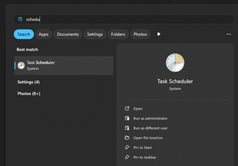
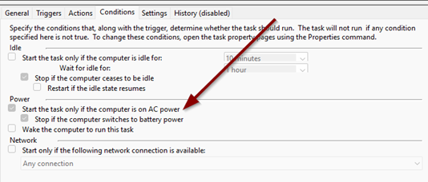

# Astuces

## Comment configurer une tâche planifiée ?

Si vous rencontrez des problèmes lors de la configuration d'une tâche planifiée pour démarrer l'application à l'ouverture de session, cela peut être dû aux paramètres par défaut de la tâche.

### Solution

Vous pouvez résoudre ce problème en modifiant les paramètres de la tâche planifiée :

1. Ouvrez le menu Démarrer et tapez **"Planificateur de tâches"**, puis sélectionnez l'option correspondante.

   

2. Localisez la tâche nommée **"Lanceur - Autorun at startup"**.
3. Faites un clic droit dessus et sélectionnez **Propriétés**.

    

4. Allez dans l'onglet **Conditions**.
5. Décochez **"Démarrer la tâche uniquement si l'ordinateur est alimenté par le secteur"**.
6. Cliquez sur **OK** pour enregistrer les modifications.

Cela devrait garantir que la tâche planifiée s'exécute correctement à l'ouverture de session.
