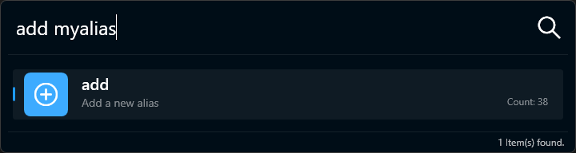
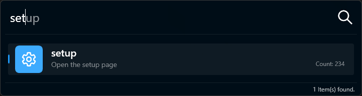
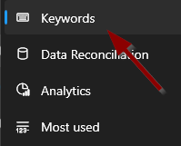
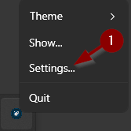
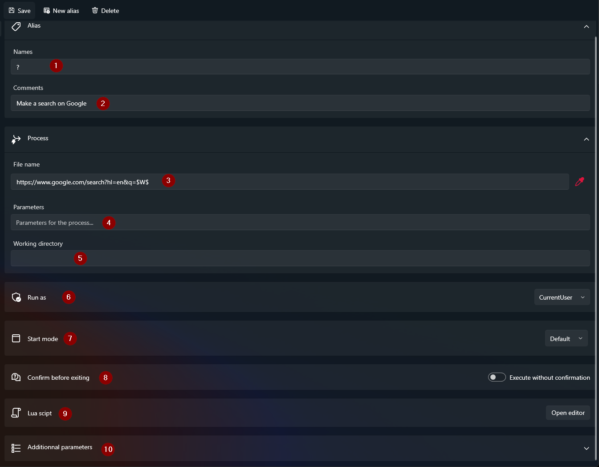
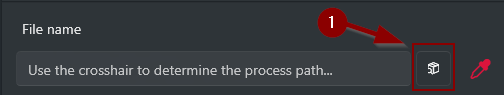
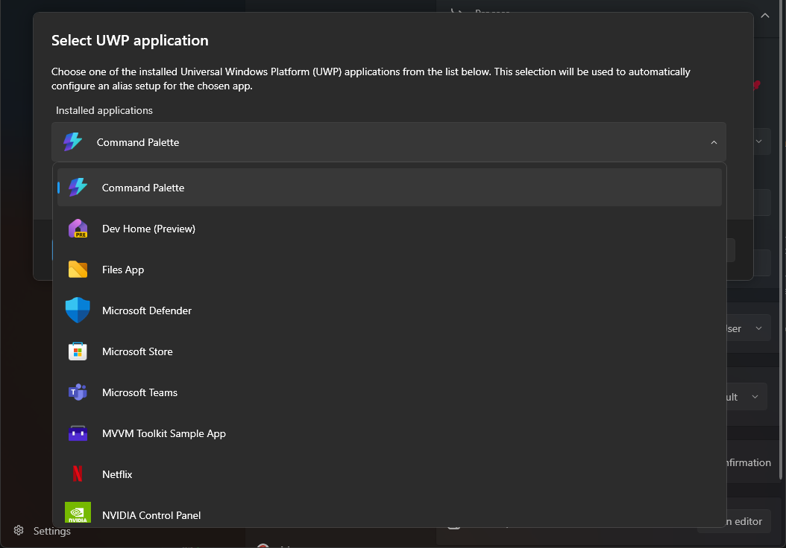
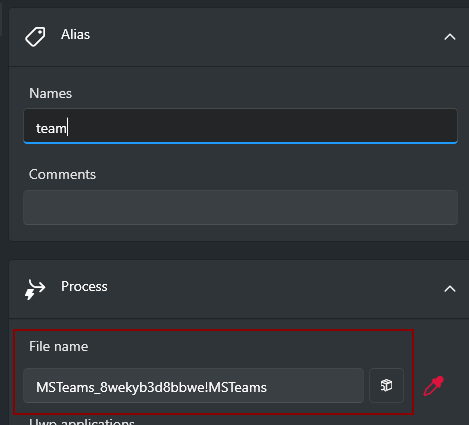

# Créer un alias

Il existe trois façons de créer un alias : via le mot-clé `add`, via le mot-clé `setup`, ou depuis les paramètres.

## Avec le mot-clé `add`

- Tapez `add <nom_alias>` et appuyez sur `Entrée` pour ouvrir la page de création. 
  

## Avec le mot-clé `setup`

- Tapez `setup` et appuyez sur `Entrée` pour ouvrir la page des paramètres. 
  

- Normalement, la page des mots-clés devrait s'ouvrir. Sinon, cliquez simplement sur `Nom du menu ici`. 
  

## Depuis les paramètres

- Faites un clic droit sur l'icône Lanceur dans la barre des tâches et sélectionnez _Paramètres..._. 
  

# Configurer l'alias et enregistrer

Vous pouvez maintenant personnaliser l'alias selon vos préférences. Une fois terminé, cliquez sur `Enregistrer` pour appliquer vos modifications.

Vous trouverez ci-dessous une explication de chaque paramètre configurable pour un alias.

| N°  | Configuration               | Description                                                                                         |
| --- | --------------------------- | --------------------------------------------------------------------------------------------------- |
| 1   | _Noms_                      | Séparez les synonymes par une virgule (`,`), pour permettre plusieurs noms pour la même application. |
| 2   | _Commentaires_              | Remplacez le nom de l'application par défaut par votre propre commentaire.                          |
| 3   | _Nom du fichier_            | Chemin de l'application. Faites glisser le sélecteur pour choisir le chemin d'une application en cours d'exécution. |
| 4   | _Paramètres_                | Paramètres à envoyer à l'application (ex. : `--private-window` pour Firefox).                       |
| 5   | _Répertoire de travail_     | Définit le répertoire de travail au démarrage de l'application.                                     |
| 6   | _Exécuter en tant que_      | Choisissez _Utilisateur courant_ ou _Administrateur_ pour exécuter avec des privilèges élevés.      |
| 7   | _Mode de démarrage_         | Choisissez _Maximisé_, _Minimisé_ ou _Par défaut_ pour définir l'état de la fenêtre au démarrage.  |
| 8   | _Confirmer avant d'exécuter_ | Demander une confirmation avant d'exécuter l'alias.                                                |
| 9   | _Script Lua_                | Exécute un script Lua avant l'alias. [Plus d'infos](fr/pages/usermanual/4.lua-scripting.md).       |
| 10  | _Paramètres supplémentaires_ | Ajoutez des paramètres en les faisant précéder d'un point-virgule (`;`). [Plus d'infos](fr/pages/usermanual/3.additional-params.md). |

## Gestion des applications UWP

Parfois, le sélecteur peut ne pas retourner correctement le nom de fichier d'un processus pour une application UWP (Universal Windows Platform). Dans ce cas, cliquez sur le bouton suivant :

Sélectionnez ensuite l'application pour laquelle vous souhaitez créer un alias :

Remplissez le formulaire comme pour tout autre processus, puis cliquez sur `ENREGISTRER`. Vous saurez que la configuration a réussi lorsque le champ `Nom du fichier` est renseigné. (Remarque : ce n'est pas un chemin de fichier standard, mais Lanceur sait comment le gérer.)

