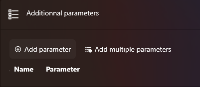
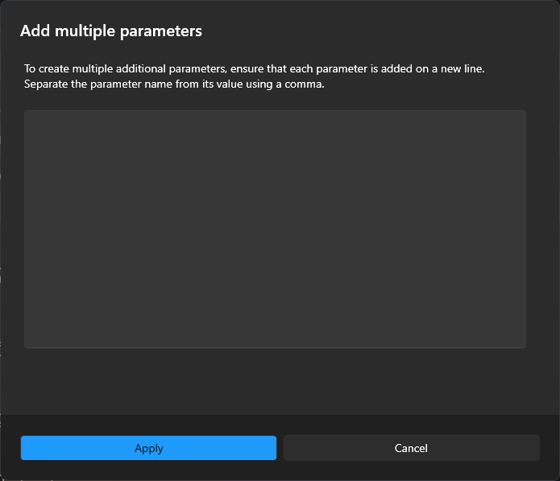

# Paramètres supplémentaires

## Qu'est-ce que c'est ?

Les paramètres supplémentaires vous permettent de personnaliser un alias en spécifiant des réglages dans la configuration. Cela évite les configurations répétitives.

## Comment les utiliser ?

Pour afficher tous les paramètres supplémentaires disponibles, appuyez sur `:` (point-virgule). Une liste de paramètres apparaîtra dans les résultats de recherche. Sélectionnez le paramètre souhaité et appuyez sur `Entrée`.

## Comment les configurer ?

- Pour ajouter un seul paramètre, cliquez sur **Ajouter un paramètre unique**.
- Pour ajouter plusieurs paramètres à la fois, cliquez sur **Ajouter plusieurs paramètres**.
  - Saisissez chaque paramètre sur une nouvelle ligne.
  - Séparez le nom du paramètre de sa valeur par une virgule.
  - Assurez-vous que chaque ligne ne contient qu'une seule virgule.

