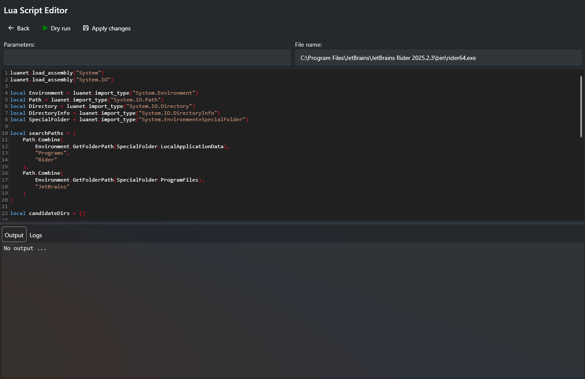

# Scripts Lua

## À quoi ça sert ?

Vous pouvez créer un script Lua à exécuter avant le démarrage de l'alias. L'objectif principal est de modifier dynamiquement les _paramètres_ ou le _nom du fichier_ de l'alias, mais vous pouvez aussi utiliser Lua pour d'autres tâches. Gardez à l'esprit que l'environnement du script n'a aucune bibliothèque préchargée — c'est du Lua pur.

## Comment l'utiliser ?

L'API du script est minimale (cf. ci-dessous). Vous pouvez effectuer un **Test à blanc** pour prévisualiser le comportement du script. Lorsque vous êtes satisfait, cliquez sur **Appliquer**. Le script ne sera enregistré dans la base de données que si vous cliquez sur **Enregistrer** sur la page principale.

Après un test à blanc, deux onglets sont affichés :

- **Sortie** — affiche la sortie du script qui vient de s'exécuter.
- **Journaux** — affiche tous les messages de journalisation ajoutés dans le script.



## API

> **Remarque :** L'API est **sensible à la casse**

### Description de `context`

Contient des informations sur le contexte du script. Cela peut être mis à jour dans le script.

L'objectif principal de la fonctionnalité de script est de mettre à jour le contexte. Ce contexte contient les valeurs suivantes :

| Propriété     | Rôle                                                                                              |
| ------------- | ------------------------------------------------------------------------------------------------- |
| `FileName`    | Le nom du fichier configuré pour cet alias                                                        |
| `Parameters`  | Les paramètres que l'utilisateur a configurés pour cet alias                                      |
| `IsCancelled` | Lorsque défini à `true`, l'alias ne sera pas exécuté. Sinon, il s'exécutera normalement.          |

### Description de `notification`

Fournit un moyen de notifier l'utilisateur via l'interface.


Les méthodes suivantes sont supportées :

| Méthode                                                             | Description                                                              |
| ------------------------------------------------------------------- | ------------------------------------------------------------------------ |
| `notification:Information("Hello world")`                           | Envoie un message d'**information**                                      |
| `notification:Warning("Hello world")`                               | Envoie un message d'**avertissement**                                    |
| `notification:Error("Hello world")`                                 | Envoie un message d'**erreur**                                           |
| `notification:InformationWithNavigation("Hello", "https://...")`    | Envoie un message d'**information** avec un bouton qui ouvre l'URL       |

### Description de `output`

Fournit un moyen d'enregistrer des messages pendant l'exécution du script. Utile pour déboguer vos scripts lors d'un **Test à blanc**.

| Méthode                      | Description                                             |
| ---------------------------- | ------------------------------------------------------- |
| `output.appendLine("texte")` | Ajoute une ligne horodatée à la sortie du script        |

### Utiliser des packages CLR

Vous pouvez utiliser n'importe quel type du framework .NET dans vos scripts. Pour importer un type, utilisez `luanet.import_type` et assignez-le à une variable locale.

Voici quelques exemples :

```lua
local Environment = luanet.import_type("System.Environment")
local Path = luanet.import_type("System.IO.Path")
local Directory = luanet.import_type("System.IO.Directory")
local DirectoryInfo = luanet.import_type("System.IO.DirectoryInfo")
local SpecialFolder = luanet.import_type("System.Environment+SpecialFolder")
```

#### Types imbriqués

Certains types .NET sont définis à l'intérieur d'autres types (types imbriqués). Pour les référencer, utilisez le symbole `+` entre le type parent et le type imbriqué.

Par exemple, `SpecialFolder` est une énumération imbriquée dans la classe `Environment`. Son nom complet est donc `System.Environment+SpecialFolder` :

```lua
local SpecialFolder = luanet.import_type("System.Environment+SpecialFolder")
local desktop = Environment.GetFolderPath(SpecialFolder.Desktop)
```
