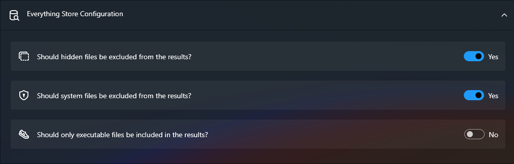

# Recherche avec Everything

## À quoi ça sert ?

Lanceur s'intègre avec [voidtools Everything](https://www.voidtools.com/) pour rechercher des fichiers sur tous vos disques.

Lanceur étant simplement une interface, vous pouvez utiliser les mêmes requêtes de recherche que dans **Everything**.

## Comment le configurer ?

Vous pouvez personnaliser le comportement de la recherche avec les paramètres suivants :

- **Exclure les fichiers cachés des résultats** : Si activé, `!is:hidden` est ajouté à chaque requête pour exclure les fichiers cachés.
- **Exclure les fichiers système des résultats** : Si activé, `!is:system` est ajouté à chaque requête pour exclure les fichiers système.
- **Inclure uniquement les fichiers exécutables dans les résultats** : Si activé, `ext:exe` est ajouté à chaque requête pour n'afficher que les fichiers exécutables.

> **Remarque :** Ces paramètres modifient vos requêtes en y ajoutant des filtres spécifiques.
>
> Pour plus de détails sur les requêtes de recherche, consultez le [Guide de recherche Everything](https://www.voidtools.com/support/everything/searching/).
