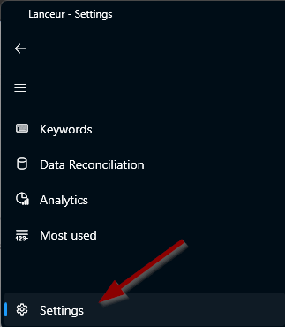
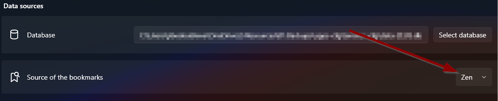
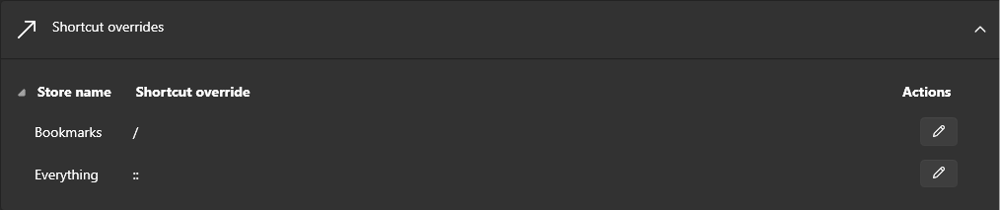

# Favoris & Raccourcis web

## À quoi ça sert ?

Une fois que vous avez spécifié le navigateur que vous utilisez, Lanceur sait où vos favoris sont stockés.

Désormais, chaque fois que vous tapez `/`, Lanceur recherche le texte saisi dans vos favoris. Lorsque vous appuyez sur `Entrée`, il l'ouvre dans votre navigateur par défaut.

> **Remarque :** Par défaut, le mot-clé pour rechercher dans vos favoris est `/`, mais il peut être modifié dans les paramètres (cf. ci-dessous).

## Comment le configurer ?

1. **Ouvrir les paramètres**

   - Tapez **`setup`** dans la barre de recherche _ou_
   - Cliquez sur l'**icône dans la barre des tâches**
     

2. **Accéder au menu des paramètres**
   

3. **Sélectionner votre navigateur préféré**
   

4. **Personnaliser le raccourci (optionnel)**
   - Vous pouvez modifier le raccourci par défaut si nécessaire.
     
