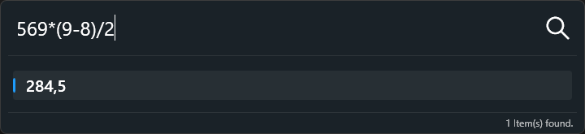

# Calculatrice

La calculatrice vous permet d'effectuer des opérations arithmétiques de base sans effort. Saisissez simplement une expression comme `3+4` et elle retournera le résultat calculé instantanément.

## Tableau des opérateurs et fonctions de **NCalc**

Ce tableau liste les opérateurs courants et les fonctions mathématiques supportés par la bibliothèque **[NCalc](https://github.com/ncalc/ncalc)** — un évaluateur d'expressions mathématiques pour .NET. Il permet d'analyser et d'évaluer des chaînes comme `3 + sin(PI/2)`. Vous pouvez trouver la documentation officielle ici :
[Documentation NCalc](https://ncalc.github.io/ncalc/articles/index.html)

## Opérateurs supportés

Le framework inclut un ensemble de fonctions déjà implémentées.

| Nom           | Description                                                                                                                                                                                                                         | Utilisation         | Résultat |
| ------------- | ----------------------------------------------------------------------------------------------------------------------------------------------------------------------------------------------------------------------------------- | ------------------- | -------- |
| Abs           | Retourne la valeur absolue d'un nombre.                                                                                                                                                                                             | Abs(-1)             | 1d       |
| Acos          | Retourne l'angle dont le cosinus est le nombre spécifié.                                                                                                                                                                            | Acos(1)             | 0d       |
| Asin          | Retourne l'angle dont le sinus est le nombre spécifié.                                                                                                                                                                              | Asin(0)             | 0d       |
| Atan          | Retourne l'angle dont la tangente est le nombre spécifié.                                                                                                                                                                           | Atan(0)             | 0d       |
| Ceiling       | Retourne le plus petit entier supérieur ou égal au nombre spécifié.                                                                                                                                                                 | Ceiling(1.5)        | 2d       |
| Cos           | Retourne le cosinus de l'angle spécifié.                                                                                                                                                                                            | Cos(0)              | 1d       |
| Exp           | Retourne e élevé à la puissance spécifiée.                                                                                                                                                                                          | Exp(0)              | 1d       |
| Floor         | Retourne le plus grand entier inférieur ou égal au nombre spécifié.                                                                                                                                                                 | Floor(1.5)          | 1d       |
| IEEERemainder | Retourne le reste de la division d'un nombre par un autre.                                                                                                                                                                          | IEEERemainder(3, 2) | -1d      |
| Ln            | Retourne le logarithme naturel d'un nombre.                                                                                                                                                                                         | Ln(1)               | 0d       |
| Log           | Retourne le logarithme d'un nombre.                                                                                                                                                                                                 | Log(1, 10)          | 0d       |
| Log10         | Retourne le logarithme en base 10 d'un nombre.                                                                                                                                                                                      | Log10(1)            | 0d       |
| Max           | Retourne le plus grand de deux nombres.                                                                                                                                                                                             | Max(1, 2)           | 2        |
| Min           | Retourne le plus petit de deux nombres.                                                                                                                                                                                             | Min(1, 2)           | 1        |
| Pow           | Retourne un nombre élevé à la puissance spécifiée.                                                                                                                                                                                  | Pow(3, 2)           | 9d       |
| Round         | Arrondit une valeur à l'entier le plus proche ou au nombre de décimales spécifié. Le comportement pour les nombres médians peut être modifié avec ExpressionOptions.RoundAwayFromZero.                                              | Round(3.222, 2)     | 3.22d    |
| Sign          | Retourne une valeur indiquant le signe d'un nombre.                                                                                                                                                                                 | Sign(-10)           | -1       |
| Sin           | Retourne le sinus de l'angle spécifié.                                                                                                                                                                                              | Sin(0)              | 0d       |
| Sqrt          | Retourne la racine carrée d'un nombre.                                                                                                                                                                                              | Sqrt(4)             | 2d       |
| Tan           | Retourne la tangente de l'angle spécifié.                                                                                                                                                                                           | Tan(0)              | 0d       |
| Truncate      | Calcule la partie entière d'un nombre.                                                                                                                                                                                              | Truncate(1.7)       | 1        |

Il inclut aussi d'autres fonctions à usage général.

| Nom  | Description                                                                                            | Utilisation                                       | Résultat                                                                              |
| ---- | ------------------------------------------------------------------------------------------------------ | ------------------------------------------------- | ------------------------------------------------------------------------------------- |
| in   | Retourne si un élément est dans un ensemble de valeurs.                                                | in(1 + 1, 1, 2, 3)                                | true                                                                                  |
| if   | Retourne une valeur selon une condition.                                                               | if(3 % 2 = 1, 'valeur vraie', 'valeur fausse')    | 'valeur vraie'                                                                        |
| ifs  | Retourne une valeur selon plusieurs conditions, avec une valeur par défaut si aucune n'est vraie.      | ifs(foo > 50, "bar", foo > 75, "baz", "quux")     | si foo est entre 50 et 75 "bar", si foo > 75 "baz", sinon "quux"                     |
