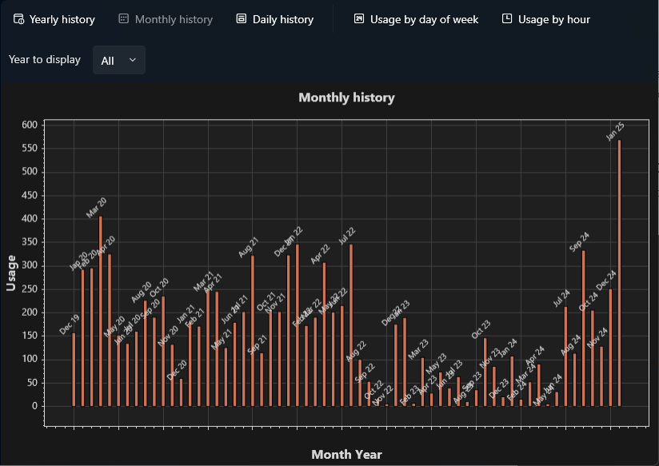
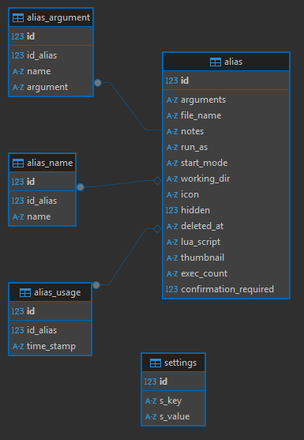

# Analytiques

Lanceur utilise une base de données **SQLite** pour stocker des données importantes telles que les alias, les paramètres de configuration et les statistiques d'utilisation des alias. Cette base de données est stockée localement par défaut dans le répertoire `%appdata%\probel\lanceur2`, mais vous pouvez la reconfigurer vers l'emplacement de votre choix.

La section analytiques de la base de données suit les métriques d'utilisation suivantes :

- **Alias lancés par année**
- **Alias lancés par mois**
- **Alias lancés par jour**
- **Tendance d'utilisation hebdomadaire**
- **Tendance d'utilisation quotidienne**
- **Tendance d'utilisation horaire**

---

## La base de données SQLite

Puisque **Lanceur** est un projet open source, le schéma de la base de données est disponible publiquement. Si vous êtes curieux de la structure, voici une représentation visuelle du schéma de la base de données pour référence :

