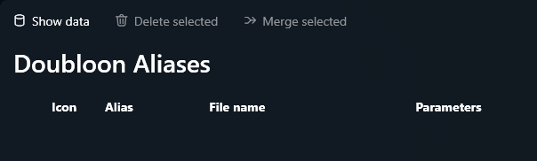

# Réconciliation des données

## Vue d'ensemble

L'outil de réconciliation des données est conçu pour identifier et traiter des états spécifiques des données dans la base de données. Il aide à garantir l'intégrité de votre système d'alias en fournissant une liste d'entrées pouvant nécessiter une attention. Les vues suivantes sont disponibles pour l'analyse :

### 1. Alias supprimés

Cette vue liste les alias qui ont été marqués comme supprimés et n'apparaîtront plus dans vos résultats de recherche. Vous pouvez utiliser cet outil pour réactiver ces alias si nécessaire.

### 2. Alias sans commentaires

Les alias sans commentaires sont des entrées qui n'ont aucun texte descriptif associé. Ces alias ne seront pas affichés de manière enrichie ou conviviale. Un outil est disponible pour appliquer un commentaire par défaut à ces alias.

### 3. Doublons (alias en double)

Cette vue liste les alias qui partagent le même nom de fichier. Certains d'entre eux peuvent ne pas être de véritables doublons — en raison de différences potentielles dans les paramètres — mais il est souvent recommandé d'utiliser la fonctionnalité `paramètre supplémentaire` dans ces cas pour éviter les conflits.

### 4. Alias brisés

Cette vue identifie les alias liés à des fichiers qui n'existent plus sur le disque. Ces liens brisés peuvent être signalés et gérés pour maintenir l'intégrité des données.

## Objectif

Cet outil de réconciliation constitue la dernière étape avant d'intervenir directement dans la base de données pour résoudre des problèmes. Il est conçu pour aider à identifier et traiter les incohérences de données de manière plus conviviale.
