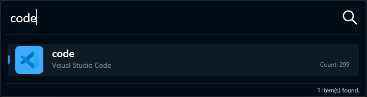

# Manuel utilisateur

## Qu'est-ce que c'est et comment ça fonctionne ?

Un alias est un mot-clé lié à une application. Lorsque l'utilisateur le tape, l'application se lance comme configuré.

Créez une liste de raccourcis, configurez-les, et gagnez du temps en tapant simplement le raccourci et en appuyant sur `ENTRÉE`.

Pour afficher la fenêtre, le raccourci par défaut est `Ctrl + Alt + Espace`.

> **Remarque :** `Ctrl + Alt` se comporte de la même manière que [AltGr](https://fr.wikipedia.org/wiki/AltGr).

Lorsque vous utilisez le raccourci, une fenêtre apparaît :

1. Dans la zone de recherche, saisissez le mot-clé que vous souhaitez exécuter.
2. Au fur et à mesure de la saisie, vous verrez les résultats correspondants (point 2).
3. Appuyez sur `ENTRÉE` pour exécuter le premier élément de la liste.
4. Vous pouvez aussi cliquer sur l'élément que vous souhaitez exécuter.

## Qu'est-ce qu'une ligne de commande ?

Une ligne de commande suit cette structure :

> `commande` [espace] `paramètres`

- Le texte avant le premier espace est la **commande** — l'action à exécuter.
- Tout ce qui suit le premier espace sont les **paramètres**, qui modifient le comportement de la commande.

Si la commande commence par l'un des caractères suivants :
`$ & | @ # ) § ! { } - _ \ + * / = < > ; : %`
alors le premier caractère est considéré comme la **commande**, et le reste comme les **paramètres**.

Par exemple, si vous avez configuré une commande de recherche Google comme suit :

| Mot-clé  | Nom du fichier                              |
| -------- | ------------------------------------------- |
| search   | https://www.google.com/search?hl=fr&q=\$W\$ |

pour rechercher "_avion_" dans Google, vous taperiez :

`search avion`.

> L'utilisation de `$W$` est expliquée [ICI](fr/pages/usermanual/2.keywords-macros-wildcards.md).
