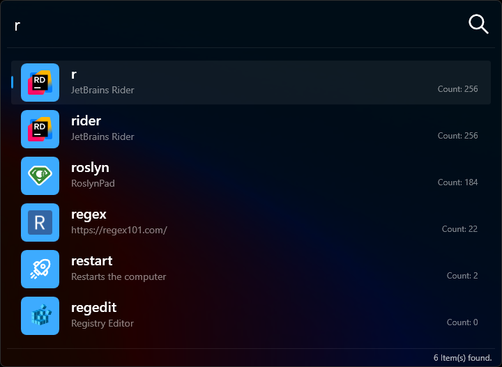

# Lanceur – Launch Anything, Instantly  

## What is Lanceur?  

Lanceur is a lightweight and highly customizable application launcher built in .NET. Inspired by [SlickRun](https://www.bayden.com/slickrun/), with features influenced by [Wox](https://github.com/Wox-launcher/Wox) and [Flow Launcher](https://www.flowlauncher.com/), it helps you open applications, files, and web pages instantly—just type a shortcut and press `ENTER`.  

I originally started Lanceur because I wanted to build my own project—something that carried my name and worked exactly the way I envisioned. I love SlickRun, but I wanted my own take on it, with a few differences that better suited my workflow. If others find it useful too, that’s a bonus!

## A little bit different than the others

Most application launchers scan everything they can find—applications, files, and web shortcuts—then try to infer what the user wants. Lanceur takes a different approach: it only searches among the aliases the user has explicitly configured. This means no unwanted results and a fully predictable experience.

This design choice offers greater control but comes with a trade-off—a slightly higher learning curve. Users need to set up their aliases beforehand, but in return, they get a fast, distraction-free workflow tailored to their needs.

## Features  

- **Custom Aliases & Parameters** – Launch applications using custom keywords, with optional dynamic arguments.  
- **Lua Scripting** – Extend alias behavior with powerful scripts.  
- **Bookmarks & Web Shortcuts** – Quickly access favorite websites.  
- **Instant File Search** – Integrated with [VoidTools Everything](https://www.voidtools.com/) for lightning-fast file searches.  
- **Built-in Calculator** – Perform quick calculations on the fly.  
- **Macro Support** – Launch multiple applications at once or generate a new GUID instantly.  
- **Usage Analytics** – Track and visualize command usage to optimize your workflow.  
- **Private & Local** – All configurations and analytics are stored securely in a local SQLite database—nothing is sent online.  
