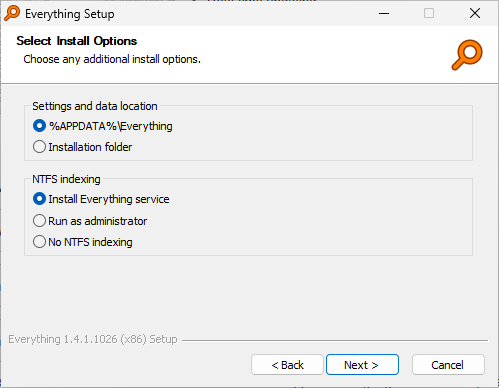

# Prerequisites for Installing Lanceur

## File Search Prerequisite

To use the file search functionality in *Lanceur*, you need to install *Voidtools Everything*.

If *Everything* is not installed or not running, the search feature will not return any results.

## Installing *Voidtools Everything*

Follow these steps to install *Everything*:

1. **Download the installer** from [HERE](https://www.voidtools.com/downloads/).
2. **Run the installer** and keep the default values during installation.
3. **Enable the service and set it to start automatically**.

