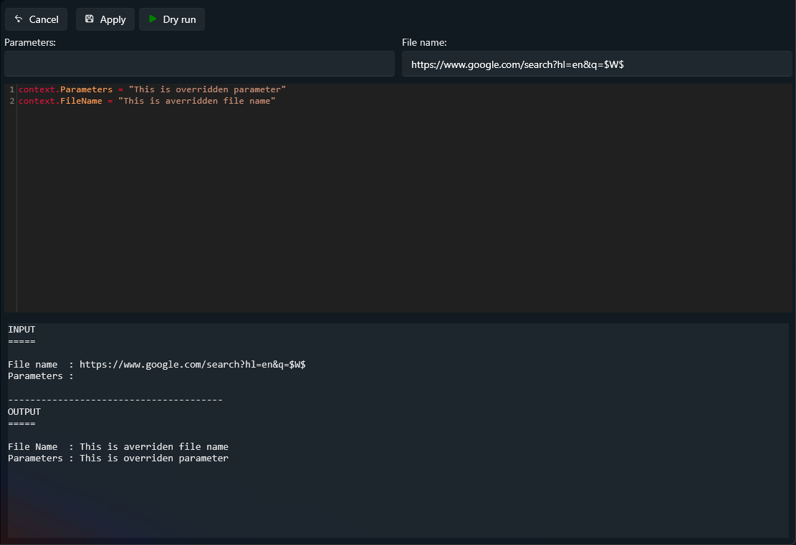

# Lua Scripting

## What does it do?

You can create a Lua script to run before the alias starts. The main purpose is to dynamically modify the _parameters_ or _file name_ of the alias, but you can use Lua for other tasks as well. Keep in mind that the script environment has no preloaded libraries—this is vanilla Lua.

## How to use it?

The script API is minimal (cf. below). You can **Dry run** the script to preview its behaviour. When you're satisfied, click **Apply**. The script will only be saved to the database if you click **Save** on the main page.

After a dry run, two tabs are displayed:

- **Output** — shows the output of the script that just ran.
- **Logs** — displays all the log messages added in the script.



## API

> **Note:** The API is **case-sensitive**

### Description of `context`

Contains information about the script context. This can be updated within the script.

The main purpose of the scripting feature is to update the context. This context includes the following values:

| Property      | Purpose                                                                 |
| ------------- | ----------------------------------------------------------------------- |
| `FileName`    | The file name configured for this alias                                |
| `Parameters`  | The parameters the user has configured for this alias                  |
| `IsCancelled` | When set to `true`, the alias will not be executed. Otherwise, it will be executed normally |

### Description of `notification`

Provides a way to notify the user through the UI.


The following methods are supported:

| Method                                                      | Description                                                        |
| ----------------------------------------------------------- | ------------------------------------------------------------------ |
| `notification:Information("Hello world")`                   | Sends an **information** message                                   |
| `notification:Warning("Hello world")`                       | Sends a **warning** message                                        |
| `notification:Error("Hello world")`                         | Sends an **error** message                                         |
| `notification:InformationWithNavigation("Hello", "https://...")` | Sends an **information** message with a button that opens the URL |

### Description of `output`

Provides a way to log messages during script execution. This is useful for debugging your scripts when using **Dry run**.

| Method                      | Description                                      |
| --------------------------- | ------------------------------------------------ |
| `output.appendLine("text")` | Appends a timestamped line to the script output  |

### Use CLR packages

You can use any type from the .NET framework in your scripts. To import a type, use `luanet.import_type` and assign it to a local variable.

Here are some examples:

```lua
local Environment = luanet.import_type("System.Environment")
local Path = luanet.import_type("System.IO.Path")
local Directory = luanet.import_type("System.IO.Directory")
local DirectoryInfo = luanet.import_type("System.IO.DirectoryInfo")
local SpecialFolder = luanet.import_type("System.Environment+SpecialFolder")
```

#### Nested types

Some .NET types are defined inside other types (nested types). To reference them, use the `+` symbol between the parent type and the nested type.

For example, `SpecialFolder` is an enum nested inside the `Environment` class. Its full name is therefore `System.Environment+SpecialFolder`:

```lua
local SpecialFolder = luanet.import_type("System.Environment+SpecialFolder")
local desktop = Environment.GetFolderPath(SpecialFolder.Desktop)
```
