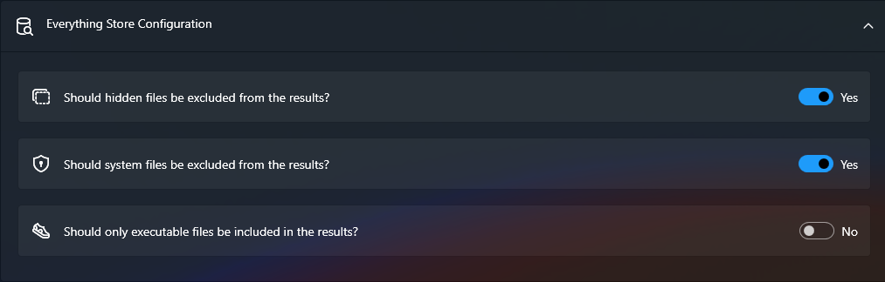

# Search with Everything

## What Does It Do?

Lanceur integrates with [voidtools Everything](https://www.voidtools.com/) to search for files across all your disks.

Since Lanceur is just a wrapper, you can use the same search queries as you would in **Everything**.

## How to Configure It

You can customize the search behavior with the following settings:

- **Exclude hidden files from results**: If enabled, `!is:hidden` is added to every query to exclude hidden files.
- **Exclude system files from results**: If enabled, `!is:system` is added to every query to exclude system files.
- **Include only executable files in results**: If enabled, `ext:exe` is added to every query to show only executable files.

> **Note:** These settings modify your queries by appending specific filters.
>
> For more details on search queries, see the [Everything Search Guide](https://www.voidtools.com/support/everything/searching/).
