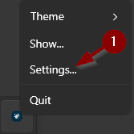
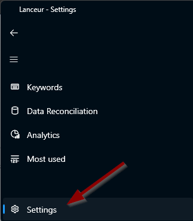
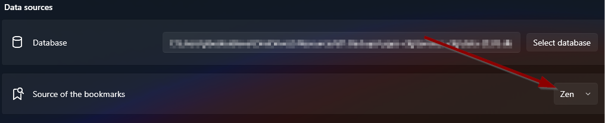
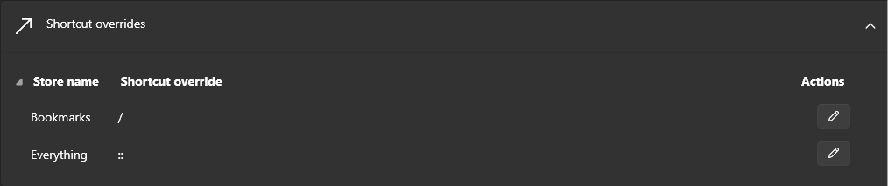

# Bookmarks & Web shortcuts

## What does it do?

Once you've specified which browser you use, Lanceur knows where your bookmarks are stored.

Now whenever you type `/` it'll search the text you type in your bookmarks. When you press `Enter`, it'll open it in your default browser

> **Note:** By default, the keyword to search in your bookmarks is `/` but it can be overridden in the settings (cf. below)

## How to Configure It?

1. **Open Settings**

   - Type **`setup`** in the search bar _or_
   - Click on the **system tray**
     

2. **Access the Settings Menu**
   

3. **Select Your Preferred Browser**
   

4. **Customize the Shortcut (Optional)**
   - You can override the default shortcut if needed.
     
