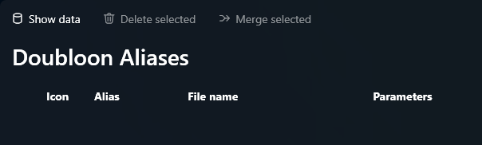

# Data Reconciliation

## Overview

The Data Reconciliation tool is designed to identify and address specific states of data within the database. It helps ensure the integrity of your alias system by providing a list of entries that may require attention. The following views are available for analysis:

### 1. Deleted Aliases

This view lists aliases that have been marked as deleted and will no longer appear in your search results. You can use this tool to reactivate these aliases if needed.

### 2. Aliases Without Comments

Aliases without comments are entries that do not have any associated descriptive text. These aliases will not be displayed in an enhanced or user-friendly way. There is a tool available to apply a default comment to these aliases.

### 3. Doubloons (Duplicate Aliases)

This view lists aliases that share the same file name. While some of these may not be actual duplicates—due to potential differences in parameters—it's often recommended to use the `additional parameter` feature in such cases to avoid conflicts.

### 4. Broken Aliases

This view identifies aliases that are linked to files that no longer exist on the disk. These broken links can be flagged and managed to maintain data integrity.

## Purpose

This reconciliation tool serves as the final step before directly intervening in the database to resolve issues. It is intended to help identify and address data inconsistencies in a more user-friendly manner.
