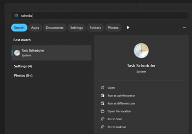
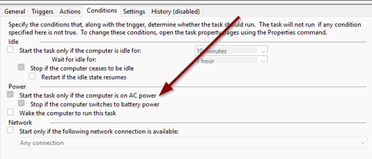

# Tips & Tricks

## How to Configure a Scheduled Task?

If you encounter issues when setting up a scheduled task to start the application at logon, it may be due to the default task settings.

### Solution

You can resolve this issue by modifying the scheduled task settings:

1. Open the Start menu and type **"Task Scheduler"**, then select the corresponding option.

   

2. Locate the task named **"Lanceur - Autorun at startup"**.
3. Right-click on it and select **Properties**.

    

1. Go to the **Conditions** tab.
2. Uncheck **"Start the task only if the computer is on AC power"**.
3. Click **OK** to save the changes.

This should ensure that the scheduled task runs correctly at logon.
