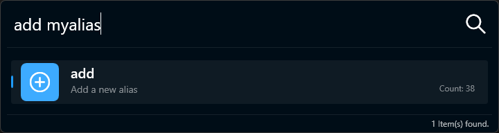
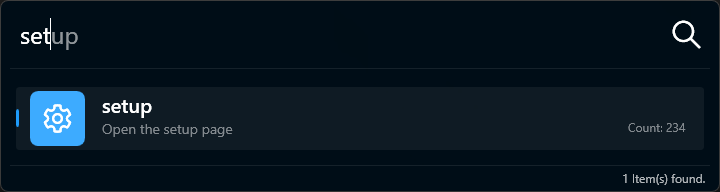
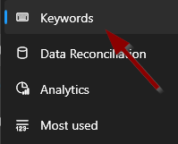

# Create Alias

There are three ways to create an alias: using the `add` keyword or via the `setup` keyword or via the settings.

## Using the `add` Keyword

-   Type `add <alias_name>` and press `Enter` to open the creation page. 
    

## Using the `setup` Keyword

-   Type `setup` and press `Enter` to open the setting page. 
    

-   Normally, the Keyword page should be opened. If not just click on `Name of the menu here`. 
    

## Using the Settings

-   Right-click the Lanceur icon in the system tray and select _Settings..._. 
    

# Set Up the Alias and Save

You can now customise the alias to your preference. Once you have finished, click `Save` to apply your changes.

Below, you will find an explanation of each setting you can configure for an alias.

| Nr  | Configuration              | Description                                                                          |
| --- | -------------------------- | ------------------------------------------------------------------------------------ |
| 1️⃣  | _Names_                    | Separate synonyms with a comma (`,`), allowing multiple names to start the same app. |
| 2️⃣  | _Comments_                 | Override the default app name with your own comment.                                 |
| 3️⃣  | _File name_                | Path of the application. Drag the file picker to select the running app’s path.      |
| 4️⃣  | _Parameters_               | Parameters to send to the app (e.g., `--private-window` for Firefox).                |
| 5️⃣  | _Working directory_        | Set the working directory when the app starts.                                       |
| 6️⃣  | _Run As_                   | Choose _Current User_ or _Admin_ to run with higher privileges.                      |
| 7️⃣  | _Start mode_               | Choose _Maximized_, _Minimized_, or _Default_ to set the window’s startup state.     |
| 8️⃣  | _Confirm before executing_ | Ask for confirmation before executing the alias.                                     |
| 9️⃣  | _Lua script_               | Run a Lua script before executing the alias. [More info][lk_2].                      |
| 🔟  | _Additional parameters_    | Add extra parameters by appending them after a semicolon (`;`). [More info][lk_1]    |

[lk_1]: ./addparams.html
[lk_2]: ./luascripting.html
